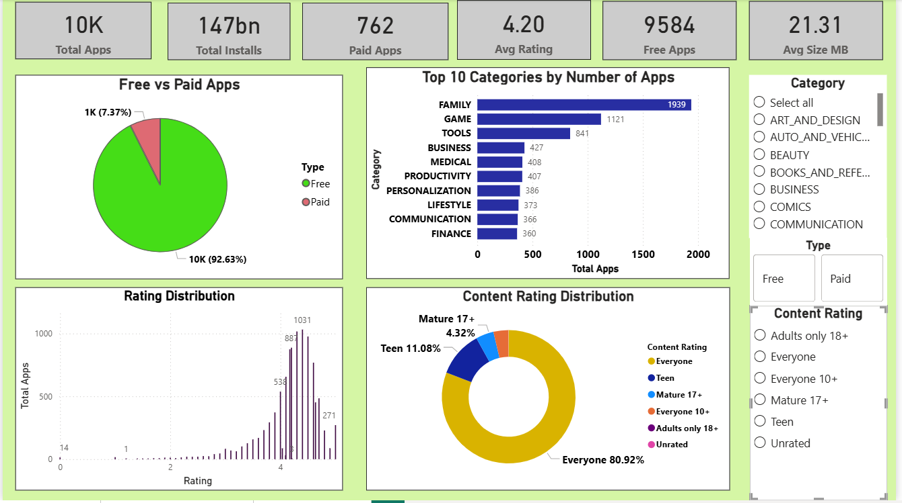
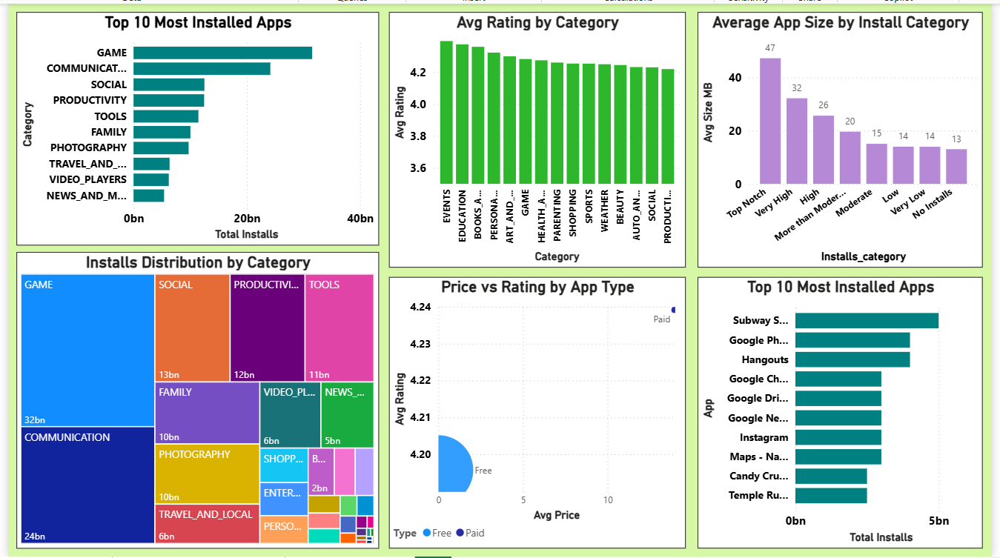
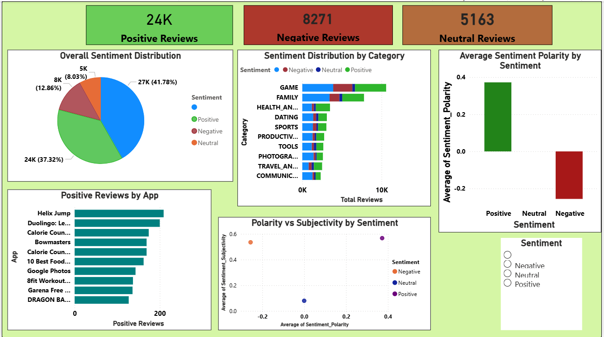
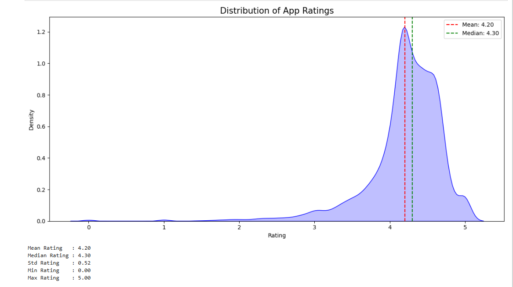
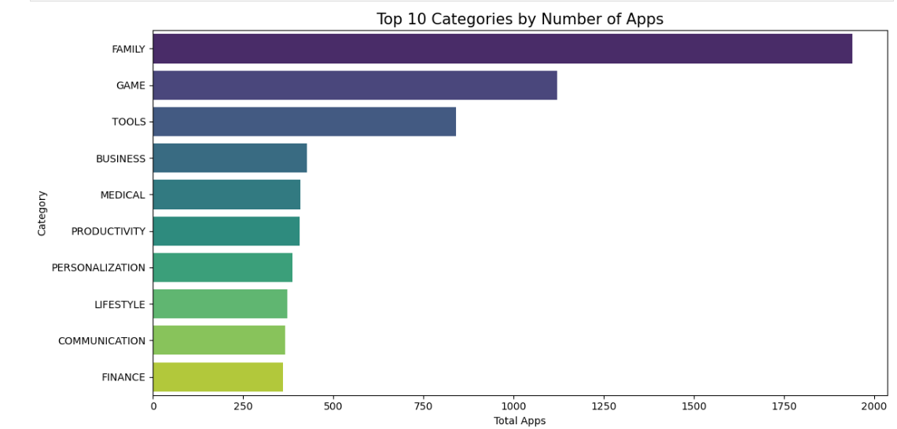
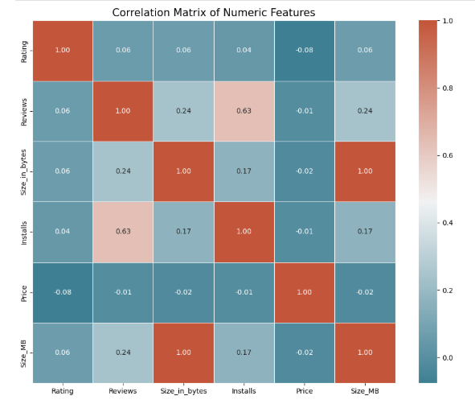
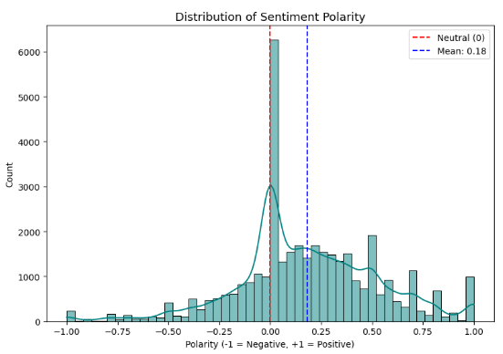

# google-playstore-analysis
Exploratory Data Analysis of Google Play Store Apps using Python, SQL, ML and Power BI

# 📱 Google Play Store Apps — Exploratory Data Analysis


---

## 📌 Project Overview

This project performs a comprehensive **Exploratory Data Analysis (EDA)**
of Google Play Store Apps using Python, MySQL, Machine Learning and Power BI.
The analysis provides actionable insights for app developers to understand
market trends, user behavior and app performance across 33 categories
and 10,346 apps.

---

## 🎯 Objectives

- Analyze app characteristics across different categories
- Identify trends in ratings, reviews, installs and pricing
- Build ML models to predict app ratings and classify success
- Perform sentiment analysis on user reviews using NLP
- Create interactive Power BI dashboards for business insights

---

## 📂 Project Structure
## 📂 Project Structure

| Folder/File | Description |
|-------------|-------------|
| `data/` | Raw and cleaned CSV datasets |
| `notebooks/` | Jupyter notebook with full analysis |
| `sql/` | SQL queries for database analysis |
| `powerbi/` | Power BI dashboard file |
| `images/` | Screenshots of visualizations |
| `README.md` | Project documentation |
| `requirements.txt` | Python dependencies |
| `.gitignore` | Git ignore file |
---

## 📊 Dataset Information

| Detail | Value |
|---|---|
| **Source** | Kaggle — Google Play Store Apps |
| **Main Dataset** | 10,841 rows × 13 columns |
| **Reviews Dataset** | 64,295 rows × 5 columns |
| **After Cleaning** | 10,346 rows × 15 columns |
| **Duplicate Rows Removed** | 483 |
| **Categories Covered** | 33 |

### Main Dataset Columns:
`App` `Category` `Rating` `Reviews` `Size` `Installs` `Type`
`Price` `Content Rating` `Genres` `Last Updated` `Current Ver` `Android Ver`

### Reviews Dataset Columns:
`App` `Translated_Review` `Sentiment` `Sentiment_Polarity` `Sentiment_Subjectivity`

---

## 🛠️ Tools & Technologies

| Tool | Purpose |
|---|---|
| **Python 3.9** | Data cleaning, analysis, ML models |
| **Pandas & Numpy** | Data manipulation |
| **Matplotlib & Seaborn** | Data visualization |
| **Scikit-learn** | Machine learning models |
| **NLTK & WordCloud** | Natural language processing |
| **MySQL Workbench** | SQL analysis & queries |
| **Power BI** | Interactive dashboards |
| **Jupyter Notebook** | Development environment |

---

## 🔄 Project Workflow
Raw Data → Data Cleaning → EDA → SQL Analysis →
Visualization → ML Models → NLP → Power BI Dashboard → Insights

---

## 🧹 Data Cleaning Steps

| Step | Action | Result |
|---|---|---|
| Corrupt Row | Removed row 10472 | Clean data |
| Reviews | String → Integer | Ready for math |
| Size | String → Bytes & MB | Ready for math |
| Installs | String → Integer | Ready for math |
| Price | String → Float | Ready for math |
| Missing Ratings | Filled by category mean | 0 nulls |
| Small Nulls | Dropped rows | Cleaner dataset |
| Duplicates | Removed 483 rows | No redundancy |

---

## 📈 Key Findings

### 📱 App Categories:
- **FAMILY** has most apps (1,939) but **GAME** has most installs (31.5B)
- **EVENTS** and **EDUCATION** have highest average ratings (4.39, 4.37)
- Top categories by installs: GAME, COMMUNICATION, SOCIAL

### ⭐ Ratings:
- Average rating: **4.19** across all apps
- Most apps rated between **4.0 — 4.5**
- Distribution is left skewed — users tend to rate positively

### 💰 Free vs Paid:
- **97%** of apps are Free
- Paid apps have slightly higher ratings (4.24 vs 4.20)
- Free apps get **165x more installs** than paid apps

### 📊 Correlations:
- Strong correlation between Reviews & Installs **(r = 0.64)**
- Rating has weak correlation with Installs **(r = 0.05)**
- Optimal app size is under **20MB** (median: 13MB)

---

## 🛢️ SQL Analysis

Key queries performed in **MySQL Workbench:**

| Query | Description |
|---|---|
| Query 1 | Top 10 Categories by Number of Apps |
| Query 2 | Top 10 Categories by Total Installs |
| Query 3 | Top 10 Most Reviewed Apps |
| Query 4 | Free vs Paid Apps Analysis |
| Query 5 | Top Rated Categories (min 50 apps) |
| Query 6 | Content Rating Distribution |
| Query 7 | Top Genres by Average Rating |
| Query 8 | Sentiment Analysis by Category |
| Query 9 | Most Installed App per Content Rating |
| Query 10 | Top 10 Most Positive Apps |

📄 See full queries: [`sql/Google play store.sql`](sql/Google play store.sql)

---

## 🤖 Machine Learning Models

### Model 1 — Rating Prediction (Regression)

**Objective:** Predict app rating based on Reviews, Installs, Size, Price

| Model | R² Score | RMSE | MAE |
|---|---|---|---|
| Linear Regression | 0.017 | 0.5221| 0.3584 |
| Ridge Regression |  0.0176  |0.5221 |0.3584|
| Lasso Regression |-0.0001 |0.5268 |0.3615 |
| Decision Tree | -0.7482 | 0.6965 |0.4520 |
| Random Forest | 0.0915 | 0.5021 | 0.3441 |
| Gradient Boosting |  0.2232 | 0.4642 | 0.3124 |

### Model 2 — App Success Classification

**Objective:** Classify apps as Successful (≥1M installs) or Not Successful

| Model | Accuracy | ROC AUC | CV Mean |
|---|---|---|---|
| Logistic Regression |  |  |  |
| Decision Tree | - | - | - |
| Random Forest | - | - | - |
| Gradient Boosting | - | - | - |
| KNN | - | - | - |
| SVM | - | - | - |


 Model  Accuracy  ROC AUC  CV Mean  CV Std
  Gradient Boosting    0.9598   0.9904   0.9542  0.0140
      Random Forest    0.9598   0.9893   0.9526  0.0136
      Decision Tree    0.9433   0.9376   0.9332  0.0217
Logistic Regression    0.8227   0.9109   0.8301  0.0304
                KNN    0.7819   0.8289   0.7429  0.0215
                SVM    0.7813   0.9408   0.7865  0.0277


### Model 3 — Sentiment Analysis (NLP)

**Objective:** Classify user reviews as Positive, Negative or Neutral

| Model | Accuracy |
|---|---|
| Logistic Regression | - |
| Naive Bayes | - |
| Linear SVM | - |
| Random Forest | - |

> 📝 Fill in your actual model scores from notebook output

---

## 📊 Power BI Dashboard

Interactive dashboard with **3 pages:**

| Page | Content |
|---|---|
| **Page 1 — Overview** | KPI Cards, Free vs Paid, Rating Distribution, Content Rating |
| **Page 2 — Category Analysis** | Top Categories, Installs, Treemap, Scatter |
| **Page 3 — Sentiment Analysis** | Sentiment Distribution, Polarity, Top Apps |

### Dashboard Screenshots:

#### 🖥️ Page 1 — Overview Dashboard


#### 📊 Page 2 — Category Analysis


#### 💬 Page 3 — Sentiment Analysis


---

## 📉 Visualization Highlights

#### Rating Distribution


#### Top Categories by Apps


#### Correlation Heatmap


#### Sentiment Distribution


#### ML Model Comparison


---

## 📝 Conclusion & Recommendations

### 📊 Project Summary Statistics
| Metric | Value |
|---|---|
| **Total Apps Analyzed** | 10,346 |
| **Categories Covered** | 33 |
| **Average Rating** | 4.19 |
| **Most Popular Category** | GAME (31.5B installs) |
| **Free vs Paid** | 97% vs 3% |
| **Best ML Model (Rating)** | Random Forest |
| **Best ML Model (Classification)** | Random Forest |
| **Best NLP Model** | Linear SVM |
| **Positive Sentiment Rate** | ~60% |

### 💡 Key Business Insights
1. **Free apps dominate** (97%), but paid apps have slightly higher ratings (4.24 vs 4.20)
2. **GAME category leads installs** (31.5B), but EVENTS has highest ratings (4.39)
3. **Reviews drive installs** — strong positive correlation (0.64)
4. **Optimal app size** is under 20MB (median: 13MB)
5. **Everyone** content rating reaches 77% of the market

### 🎯 Actionable Recommendations

**For Developers:**
- Target **GAME or FAMILY** categories for maximum reach
- Keep app size **under 20MB**
- Use **freemium model** (free apps get 165x more installs)

**For Marketers:**
- **Generate reviews** — directly correlates with installs
- Highlight **high ratings** in ads (trust signal)
- Target **HEALTH & FITNESS** for positive sentiment (0.28 polarity)

**For Store Managers:**
- Improve **category discovery** for non-GAME apps
- Review **paid app pricing** ($14.01 avg may deter users)

### ⚠️ Limitations
- Missing size data for 15.6% of apps ("Varies with device")
- Sentiment analysis limited by translated reviews quality
- Snapshot data — no temporal trends available
- Rating imputation may slightly affect analysis accuracy

### 🚀 Future Work
- Deep Learning for sentiment analysis (BERT/LSTM)
- Time series analysis of app updates and rating changes
- Build app recommendation system
- Expand dataset with more recent Play Store data

> 💡 **Bottom Line:** App Success = Right Category + Quality + Active User Engagement

---

## ⚙️ How to Run

### 1. Clone Repository
```bash
git clone https://github.com/YourUsername/google-playstore-analysis.git
cd google-playstore-analysis
```

### 2. Install Requirements
```bash
pip install -r requirements.txt
```

### 3. Run Jupyter Notebook
```bash
jupyter notebook notebooks/google_playstore_analysis.ipynb
```

### 4. SQL Setup
```bash
# 1. Open MySQL Workbench
# 2. Create database: CREATE DATABASE playstore_db;
# 3. Run: sql/playstore_queries.sql
```

### 5. Power BI Dashboard
```bash
# Open powerbi/playstore_dashboard.pbix
# in Power BI Desktop
```

---


